# NVIDIA cuPHY 5G 物理層信號處理庫

## 概述

NVIDIA cuPHY 是一個高效能的 CUDA 加速 5G NR 物理層信號處理庫，實現了完整的上下行鏈路信號處理管道。該庫提供了針對 NVIDIA GPU 優化的實現，支援即時 5G 基地台和終端設備的信號處理需求。

## 核心特性

- 🚀 **GPU 加速**: 完全 CUDA 實現，支援最新 NVIDIA GPU 架構 (Volta/Turing/Ampere/Hopper/Blackwell)
- 📡 **完整信號處理鏈**: 涵蓋上下行同步、信道估計、均衡、解碼等全流程
- ⚡ **超低延遲**: 微秒級延遲設計，支援即時處理
- 🔧 **靈活配置**: 支援多種編碼方案、調制格式和傳輸配置
- 🐍 **Python API**: 完整 pybind11 綁定，便於算法快速原型設計
- 📊 **多精度支援**: FP32/FP16 混合精度，優化吞吐量和功耗

---

## 模組功能總覽

| # | 模組名稱 | 功能描述 | 應用場景 |
|---|---------|---------|---------|
| 1 | **CFO/TA 估計** | 載波頻率偏移與定時進階估計，用於接收同步校正 | PUSCH/PDSCH 接收 |
| 2 | **通道估計** | 基於 RKHS/分窗口等多算法的信道估計，支援 DMRS 和 SRS | 上下行信道估計 |
| 3 | **通道均衡** | MMSE 線性均衡器，支援大規模 MIMO 和多層處理 | PUSCH/PDSCH 均衡 |
| 4 | **時頻濾波** | MMSE 1D 時頻域濾波，用於精細信道估計 | 高速移動場景 |
| 5 | **Polar 碼樹** | Polar 碼樹類型計算和凍結比特設置 | Polar 碼編解碼 |
| 6 | **CRC 編解碼** | 多項式 CRC-24/16/11/6 計算和校驗 | 傳輸塊完整性檢驗 |
| 7 | **CSI-RS 生成** | 信道狀態信息參考信號生成，支援 CDM 和預編碼 | 下行通道測量 |
| 8 | **CSI-RS 接收** | CSI-RS 提取和通道估計，支援多密度配置 | 上行通道反饋 |
| 9 | **解擾碼** | Fibonacci/Galois LFSR 解擾碼實現 | 所有上行信號 |
| 10 | **下行速率匹配** | 下行速率匹配、比特選擇和調制映射 | PDSCH 傳輸 |
| 11 | **LDPC 解碼** | 14 種 LDPC 解碼算法，自動選擇最優實現 | 下行 HARQ 解碼 |
| 12 | **LDPC API** | LDPC 編解碼 API 層，支援多傳輸塊管理 | 編解碼流程管理 |
| 13 | **調制映射** | QPSK/16/64/256-QAM 星座映射和調制 | 發送調制 |
| 14 | **PDCCH 嵌入** | 物理下行控制通道生成，支援多聚合等級 | DCI 傳輸 |
| 15 | **PDSCH DMRS** | PDSCH 解調參考信號生成，支援預編碼 | 下行信道估計 |
| 16 | **Polar 解碼** | 單/多路徑 SC/SCL Polar 碼解碼 | UCI 和控制信息解碼 |
| 17 | **Polar 編碼** | Polar 碼編碼、速率匹配和交織 | UCI 和控制信息編碼 |
| 18 | **Polar 分段處理** | 速率匹配恢復和交織恢復，3 區域支援 | Polar 碼解碼前處理 |
| 19 | **PRACH 接收** | 隨機接入信號檢測，支援多時機聚合 | 上行隨機接入 |
| 20 | **PUCCH F0 接收** | 簡潔 PUCCH 格式接收（M-PSK 調制） | 上行 ACK/NACK 反饋 |
| 21 | **PUCCH F1 接收** | 標準 PUCCH 格式接收（循環移位編碼） | 上行 UCI 傳輸 |
| 22 | **PUCCH F234 分段** | 長 PUCCH 格式 UCI 分段處理 | 長 PUCCH 消息分割 |
| 23 | **PUCCH F2 前端** | PUCCH F2 接收前端，軟解調和 DMRS 估計 | 長 PUCCH 信號處理 |
| 24 | **PUCCH F3 前端** | PUCCH F3 接收前端，並行 UCI 處理（18 路） | 超寬帶 PUCCH |
| 25 | **PUCCH 接收** | 完整 PUCCH 接收管道，支援 F0-F4 格式 | 上行控制信號集成 |
| 26 | **PUSCH 雜訊估計** | 接收端雜訊功率和干擾功率估計 | 接收性能評估 |
| 27 | **PUSCH 功率測量** | 接收信號強度和參考信號功率測量 | 鏈路品質監測 |
| 28 | **速率匹配** | PUSCH 反速率匹配和 DLSCH 速率匹配 | 編碼效率控制 |
| 29 | **隨機數產生** | 高速正態/均勻分佈和比特生成 | 雜訊模擬和初始化 |
| 30 | **Simplex 解碼** | Simplex 碼解碼，支援 K=1/2 | 短碼字解碼 |
| 31 | **軟解映射** | QAM 星座軟解映射，LLR 計算 | 接收解調 |
| 32 | **SRS 信道估計** | 上行參考信號通道估計，雙算法支援 | 上行信道測量 |
| 33 | **SRS 發送** | 上行參考信號生成，Zadoff-Chu 序列 | 上行同步和測量 |
| 34 | **同步信號** | PSS/SSS 信號生成和檢測 | 下行同步 |
| 35 | **TensorRT 引擎** | TensorRT 推理整合，支援 ML 信道估計 | 神經網路加速 |
| 36 | **UCI on PUSCH** | 上行控制信息多工和編碼集成 | HARQ-ACK/CSI 反饋 |
| 37 | **Gold 序列** | LFSR 和 Gold 序列生成，LUT 優化 | 擾碼種子生成 |
| 38 | **波束成型係數** | MMSE 波束成型係數計算，支援 64 天線 | 多天線接收處理 |

---

## 核心模組架構圖

### 1. CFO/TA 估計 (載波頻率偏移與定時進階估計)

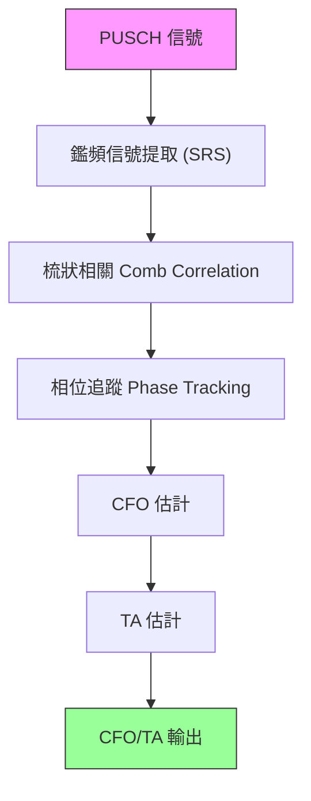

**圖解說明**:
- **鑑頻信號提取**: 從接收的 PUSCH/SRS 信號中分離出參考信號。
- **梳狀相關 (Comb Correlation)**: 利用參考信號的週期性結構進行相關運算，以捕捉相位的變化。
- **相位追蹤 (Phase Tracking)**: 根據相關結果，追蹤隨時間變化的相位偏移。
- **CFO 估計**: 根據相位斜率計算載波頻率偏移 (Carrier Frequency Offset)，用於校正接收頻率。
- **TA 估計**: 分析信號到達時間的偏差 (Timing Advance)，用於上行傳輸時間校正，確保信號在正確時間到達基站。

**流程敘述**:
接收的 **PUSCH 信號** 先進入「**鑑頻信號提取 (SRS)**」取出可用來估測偏移的參考成分，接著以「**梳狀相關**」量測相位變化，再由「**相位追蹤**」把相位隨時間的漂移連續化，最後分別推導出「**CFO 估計**」與「**TA 估計**」，輸出 **CFO/TA** 供後續的同步/補償模組使用。

### 2. 通道估計 (RKHS/小型/分窗口多算法)

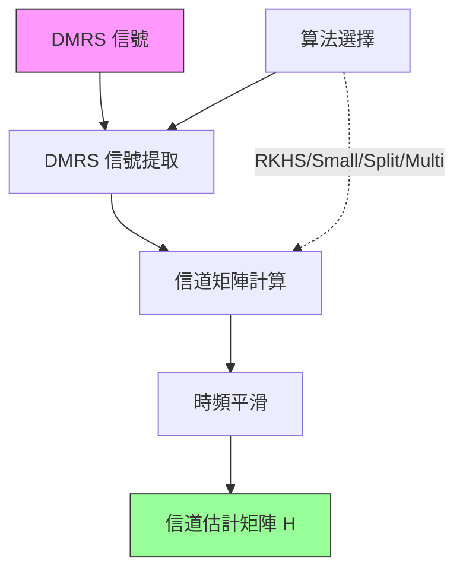

**圖解說明**:
- **DMRS 信號提取**: 從接收資源網格中提取解調參考信號 (DMRS)，這是已知的導頻信號。
- **算法選擇**: 根據配置選擇最佳估計算法 (RKHS 適用於高移動性，分窗口適用於大延遲擴展)。
- **信道矩陣計算**: 在導頻位置計算初步的信道響應 (H)。
- **時頻平滑**: 使用插值和平滑濾波器，將導頻處的信道信息擴展到整個時頻資源塊。
- **信道估計矩陣 H**: 輸出的完整信道狀態信息 (CSI)，用於後續的均衡和波束成型。

**流程敘述**:
系統先依配置做「**算法選擇**」（圖中的虛線表示：此選擇會影響後續的估測計算方式），接著將 **DMRS 信號** 送入「**DMRS 信號提取**」取得導頻位置的觀測值，再進行「**信道矩陣計算**」得到導頻點上的初始 $H$，最後透過「**時頻平滑**」把導頻資訊在時域/頻域上插值與去噪，輸出完整的 **信道估計矩陣 $H$**。

### 3. 通道均衡 (MMSE 線性均衡)

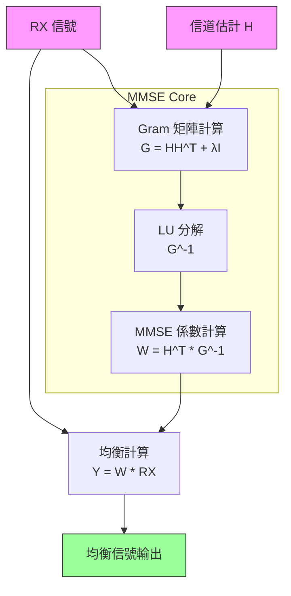

**圖解說明**:
- **Gram 矩陣計算**: 構建相關矩陣 G，結合了信道相關性 $HH^T$ 和雜訊正則化項 $\lambda I$。
- **LU 分解**: 使用高斯消元法對 Gram 矩陣進行分解，並計算其逆矩陣 $G^{-1}$，是 MMSE 的計算核心。
- **MMSE 係數計算**: 生成均衡器權重矩陣 $W$，目的是最小化接收信號與發送信號之間的均方誤差。
- **均衡計算**: 將權重矩陣 $W$ 應用於接收信號 $RX$，消除信道干擾和空間流間的串擾。

**流程敘述**:
「**RX 信號**」與「**信道估計 $H$**」同時送入 MMSE Core：先做「**Gram 矩陣計算**」形成 $G = HH^T + \lambda I$，再用「**LU 分解**」求解 $G^{-1}$（或等價的線性方程解），接著計算均衡權重「**$W = H^T G^{-1}$**」。最後把 $W$ 套用到 **RX** 做「**均衡計算**」，輸出已抑制干擾/串擾的 **均衡信號**。

### 4. LDPC 解碼 (14 種算法)

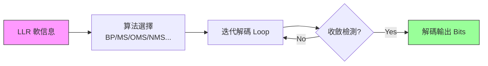

**圖解說明**:
- **LLR 軟信息**: 輸入的對數似然比，代表每個比特為 0 或 1 的概率可信度。
- **算法選擇**: 系統根據信噪比和延遲要求，自動選擇最佳解碼算法 (如 Min-Sum, Belief Propagation)。
- **迭代解碼**: 在變數節點和校驗節點之間反覆傳遞訊息，逐步修正錯誤。
- **收斂檢測**: 檢查當前解碼結果是否滿足校驗方程 (Syndrome Check)，若滿足則提前終止以節省功耗。

**流程敘述**:
解碼器以 **LLR 軟信息** 為輸入，先進行「**算法選擇**」決定使用 BP/MS/OMS/NMS 等更新規則；接著進入「**迭代解碼 Loop**」在變數節點/校驗節點之間反覆更新訊息，並在每輪後做「**收斂檢測**」。若檢測 **未收斂**（圖中的回圈箭頭）則回到迭代繼續；若 **已收斂** 則輸出最終的 **解碼 Bits**。

### 5. Polar 解碼 (SC/SCL 多路徑)

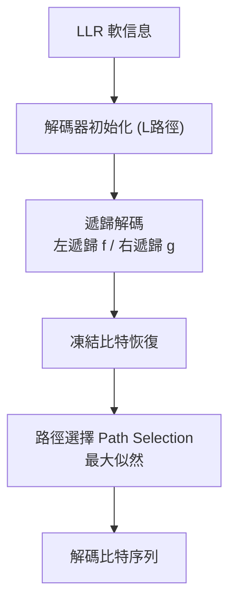

**圖解說明**:
- **解碼器初始化**: 對於 SCL (Successive Cancellation List) 解碼，初始化 L 條並行搜索路徑。
- **遞歸解碼**: 依序執行 f 運算 (校驗節點) 和 g 運算 (變數節點)，遍歷極化碼樹。
- **凍結比特恢復**: 對於已知的凍結比特位置，直接賦值；對於信息比特，根據路徑度量進行決策。
- **路徑選擇**: 在解碼結束時，從 L 條候選路徑中選擇通過 CRC 校驗且路徑度量 (PM) 最佳的一條。

**流程敘述**:
以 **LLR 軟信息** 進入解碼器後，先做「**解碼器初始化**」建立（單一路徑 SC 或多路徑 SCL 的）候選路徑集合，接著沿 Polar 碼樹做「**遞歸解碼**」（f/g 運算）逐步生成每個比特的決策；在過程中對凍結位元做「**凍結比特恢復**」，最後在終點做「**路徑選擇**」挑出度量最佳/通過校驗的路徑，輸出 **解碼比特序列**。

### 6. PUCCH 完整接收管道

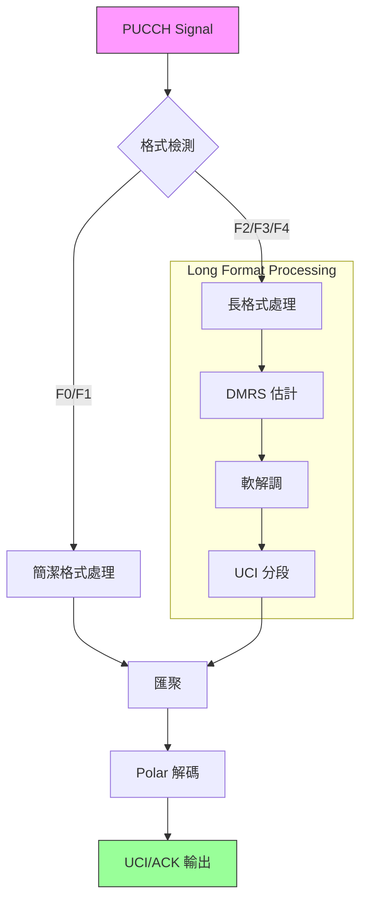

**圖解說明**:
- **格式檢測**: 識別 PUCCH 格式 (短格式 F0/F1 用於簡單 ACK/SR，長格式 F2/F3/F4 用於大量 CSI 反饋)。
- **簡潔格式處理**: 針對短格式的特殊優化，直接進行序列檢測。
- **長格式處理**: 類似 PUSCH 的完整處理鏈，包含導頻估計、解調。
- **UCI 分段**: 對於長控制訊息，將其分割為適合 Polar 編碼的小段。
- **Polar 解碼**: 將解調後的軟信息還原為原始控制比特 (UCI)。

**流程敘述**:
PUCCH 進入後先做「**格式檢測**」分流：若為 **F0/F1** 走「**簡潔格式處理**」快速偵測；若為 **F2/F3/F4** 則走長格式鏈路：先做「**DMRS 估計**」取得控制信號的通道資訊，再「**軟解調**」生成 LLR，並在「**UCI 分段**」把不同類型/長度的 UCI 拆分成可解碼片段。兩條路徑的結果在「**匯聚**」點合併後，送入「**Polar 解碼**」恢復 UCI，比特最終以 **UCI/ACK 輸出**。

### 7. SRS 信道估計 (上行參考信號)

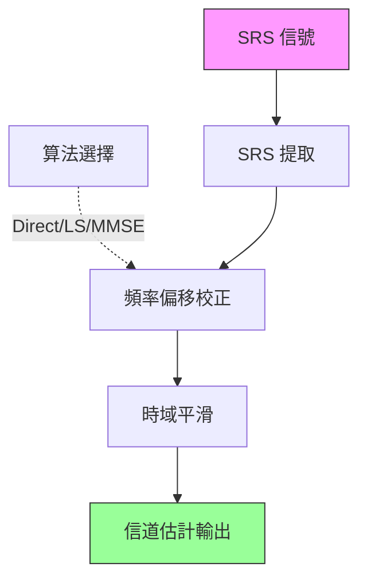

**圖解說明**:
- **SRS 提取**: 從上行信號中分離探測參考信號 (Sounding Reference Signal)。
- **頻率偏移校正**: 補償由於多普勒效應或振盪器誤差造成的相位旋轉。
- **時域平滑**: 在時域上對估計結果進行平均，降低雜訊影響，獲得更準確的上行信道狀態。
- **信道估計輸出**: 用於基站進行上行頻率選擇性調度或預編碼計算。

**流程敘述**:
以 **SRS 信號** 為輸入，先做「**SRS 提取**」取得參考序列所在資源；同時「**算法選擇**」以虛線表示其會影響後續估測/補償策略。之後資料進入「**頻率偏移校正**」消除相位旋轉，再做「**時域平滑**」降低雜訊並提升穩定性，最後輸出上行的 **信道估計** 供波束成型/調度使用。

### 8. Gold 序列生成

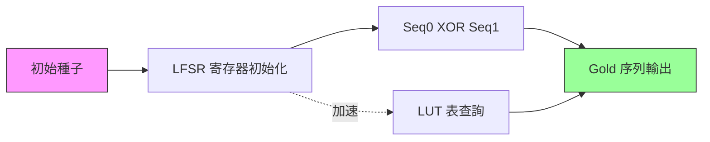

**圖解說明**:
- **初始種子**: 根據小區 ID (Cell ID) 和時隙號 (Slot ID) 生成唯一的初始化狀態。
- **LFSR 寄存器**: 兩個 m-序列生成器 (Linear Feedback Shift Register) 並行運作。
- **XOR**: 將兩個 m-序列進行模 2 加法，生成具有良好互相關特性的 Gold 序列。
- **LUT 表查詢**: 為加速生成，預先計算序列片段存於查找表 (Look-Up Table)，實現單指令生成多比特。
- **Gold 序列輸出**: 用於加擾 (Scrambling)、解擾及生成參考信號。

**流程敘述**:
由「**初始種子**」初始化兩組「**LFSR 寄存器**」後，兩條 m-sequence 產生器並行推進並在「**XOR**」節點做模 2 相加形成 Gold 序列；圖中的虛線分支表示可選的「**LUT 表查詢**」加速路徑（以預先計算片段取代逐比特推進）。最終輸出 **Gold 序列** 用於擾碼/參考信號等用途。

### 9. 波束成型係數 (MMSE)

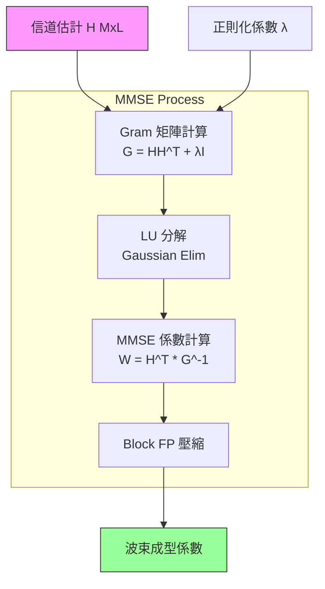

**圖解說明**:
- **信道估計 H**: 來自 SRS 或 DMRS 的信道矩陣 (天線數 x 層數)。
- **正則化係數 λ**: 用於平衡干擾抑制與雜訊放大的參數。
- **MMSE Process**: 執行矩陣反演運算，這是大規模 MIMO 中計算量最大的部分。
- **Block FP 壓縮**: 將計算出的高精度係數壓縮為塊浮點格式，以減少傳輸頻寬和存儲需求。
- **波束成型係數**: 最終的加權矩陣，用於將信號能量聚焦到特定用戶方向。

**流程敘述**:
「**信道估計 $H$**」與「**正則化係數 $\lambda$**」先用於建立「**Gram 矩陣**」，在 MMSE Process 內透過「**LU 分解**」求得反演/解的結果，進而計算「**MMSE 係數**」形成權重矩陣 $W$；之後將 $W$ 經「**Block FP 壓縮**」轉為可部署/可傳輸的格式，輸出最終的 **波束成型係數**。

### 10. 軟解映射 (QAM LLR 計算)

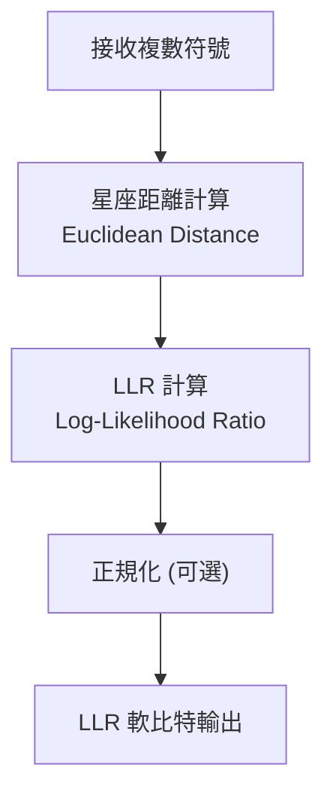

**圖解說明**:
- **接收複數符號**: 均衡後的 IQ 符號點。
- **星座距離計算**: 計算接收點到標準 QAM 星座圖上各個理想點的歐幾里得距離。
- **LLR 計算**: 將距離轉換為概率，計算每個比特為 0 或 1 的對數似然比。距離越近，LLR 絕對值越大（越可信）。
- **LLR 軟比特輸出**: 輸出給解碼器 (LDPC/Polar) 的軟判決信息。

**流程敘述**:
均衡後的「**接收複數符號**」先進入「**星座距離計算**」取得與各候選星座點的距離，接著在「**LLR 計算**」把距離轉成每個 bit 的軟可信度（LLR），必要時可再做「**正規化**」以匹配後端解碼器的動態範圍，最後輸出 **LLR 軟比特** 供 LDPC/Polar 解碼使用。

## cuPHY 模組關係圖 (系統視圖)

此視圖展示了 cuPHY 各個核心模組如何協同工作以處理 5G 信號。

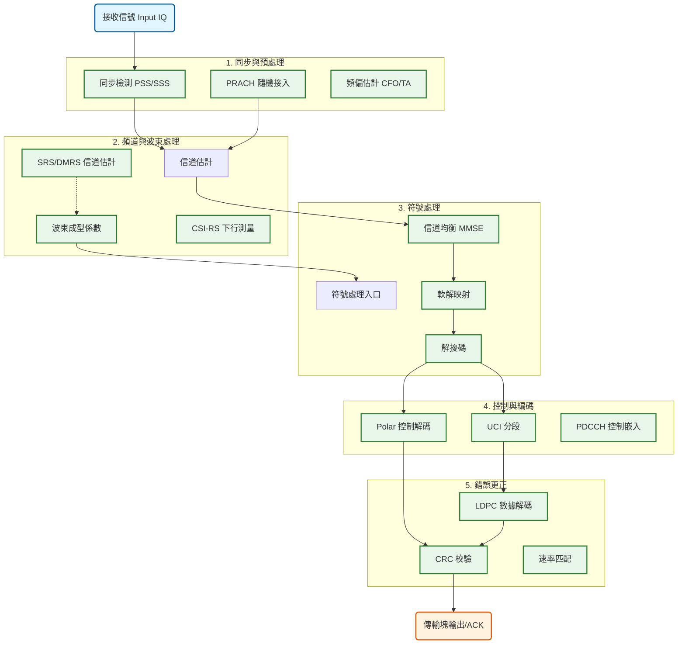

**圖解說明**:
- **S1 同步與預處理**: 負責物理層的時頻同步，確保信號對齊。
- **S2 頻道與波束處理**: 估計無線信道狀態，計算波束成型權重，這是 Massive MIMO 的核心。
- **S3 符號處理**: 在頻域對 IQ 符號進行恢復、解調和去噪。
- **S4 控制與編碼**: 處理 L1/L2 控制信令 (UCI, DCI)，實現鏈路管理。
- **S5 錯誤更正**: 執行高性能通道編碼 (LDPC 數據, Polar 控制)，確保數據傳輸的可靠性。
- **箭頭流向**: 展示了從原始 IQ 數據到最終傳輸塊 (Transport Block) 的完整數據流動路徑。

**流程敘述**:
整體資料流可由左至右理解：**接收信號 Input IQ** 先進入 **S1** 做同步（必要時包含 PRACH 檢測與 CFO/TA 校正），同步後進入 **S2** 進行 **信道估計**，並由 **SRS/DMRS** 提供量測以（虛線）驅動 **BFC** 計算波束權重；接著進入 **S3** 以 **MMSE 均衡** 恢復符號，再做 **軟解映射** 產生 LLR，並完成 **解擾碼**；然後在 **S4** 將 LLR 分流到 **Polar 控制解碼** 與 **UCI 分段**；最後在 **S5** 以 **LDPC/Polar** 完成錯誤更正並做 **CRC 校驗**，輸出最終 **傳輸塊/ACK**。

---

## 信號處理流程

### 下行鏈路 (PDSCH) 接收完整流程

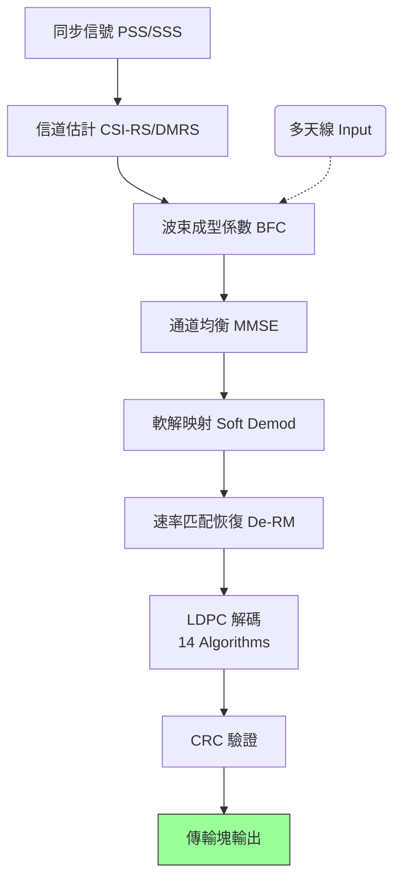

**圖解說明**:
此流程展示了終端 (UE) 接收下行數據的步驟：
1. **同步**: 鎖定小區時序。
2. **信道估計 & 波束成型**: 獲取信道狀態並計算接收波束。
3. **均衡 & 解調**: 消除干擾並將模擬波形轉換為數字軟比特。
4. **解碼 & 校驗**: 更正傳輸錯誤並驗證數據完整性，最終輸出用戶數據。

**流程敘述**:
下行接收時，UE 先以 **PSS/SSS** 完成同步（SS），再用 **CSI-RS/DMRS** 做 **信道估計**（ChEst）。估得的通道資訊用來計算/選擇 **波束成型係數 BFC**（圖中虛線表示多天線輸入也會影響 BFC），接著進入 **MMSE 均衡**（Eq）恢復等效單流/多流符號；再做 **軟解映射**（Soft）得到 LLR，經 **De-RM** 還原速率匹配後送入 **LDPC 解碼**，最後以 **CRC 驗證** 確認正確性並輸出 **傳輸塊**。

### 上行鏈路 (PUSCH) 接收完整流程

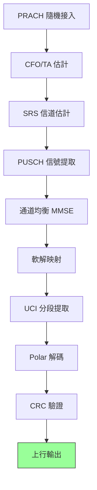

**圖解說明**:
此流程展示了基站 (gNB) 接收上行數據的步驟：
1. **隨機接入 & 同步**: 檢測用戶請求並校正頻偏 (CFO) 和時偏 (TA)。
2. **信道估計**: 利用 SRS 獲取上行信道質量。
3. **信號提取 & 均衡**: 從資源格中提取用戶數據並均衡。
4. **UCI分離**: 分離出控制信息 (如 ACK/NACK)。
5. **解碼**: 分別對數據和控制信息進行解碼和校驗。

**流程敘述**:
上行接收時，gNB 先由 **PRACH** 進行隨機接入偵測並取得初始同步資訊，接著做 **CFO/TA 估計**（CFO）以校正時頻偏移；然後用 **SRS 信道估計**（SRS）取得上行通道狀態，將其帶入 **PUSCH 信號提取**（Extract）與後續 **MMSE 均衡**（Eq）恢復用戶符號；再做 **軟解映射**（Soft）產生 LLR，經 **UCI 分段提取**（UCI）把控制與資料分離，控制部分送入 **Polar 解碼**，最後以 **CRC 驗證** 統一檢查並輸出上行結果（Out）。

---

## 文件組織結構

```
[cuphy]/
├── README.md                      # 本檔案 - 模組總覽和架構
├── Gold_sequence.md               # Gold 序列生成
├── bfc.md                         # 波束成型係數計算
├── cfo_ta_est.md                  # CFO/TA 估計
├── ch_est.md                      # 通道估計 (多算法)
├── channel_eq.md                  # 通道均衡 (MMSE)
├── crc.md                         # CRC 編碼/解碼
├── csirs.md                       # CSI-RS 生成
├── csirs_rx.md                    # CSI-RS 接收
├── descrambling.md                # 解擾碼
├── dl_rate_matching.md            # 下行速率匹配
├── error_correction.md            # LDPC 錯誤更正
├── ldpc.md                        # LDPC API
├── modulation_mapper.md           # 調制映射
├── pdcch.md                       # PDCCH 嵌入
├── pdsch_dmrs.md                  # PDSCH DMRS
├── polar_decoder.md               # Polar 解碼
├── polar_encoder.md               # Polar 編碼
├── polar_seg_deRm_deItl.md        # Polar 分段處理
├── prach_receiver.md              # PRACH 接收
├── pucch_F0_receiver.md           # PUCCH F0 接收
├── pucch_F1_receiver.md           # PUCCH F1 接收
├── pucch_F234_uci_seg.md          # PUCCH F234 分段
├── pucch_F2_front_end.md          # PUCCH F2 前端
├── pucch_F3_front_end.md          # PUCCH F3 前端
├── pucch_receiver.md              # PUCCH 完整接收
├── pusch_noise_intf_est.md        # PUSCH 雜訊干擾估計
├── pusch_rssi.md                  # PUSCH 功率測量
├── rate_matching.md               # 速率匹配
├── rng.md                         # 隨機數產生器
├── simplex_decoder.md             # Simplex 解碼
├── soft_demapper.md               # 軟解映射
├── srs_chEst.md                   # SRS 信道估計
├── srs_tx.md                      # SRS 發送
├── ss.md                          # 同步信號 (PSS/SSS)
├── trt_engine.md                  # TensorRT 引擎
└── uci_on_pusch.md                # UCI on PUSCH
```

---

## 快速開始指南

### Python 示例 - 下行接收

```python
import cuphy

# 1. 同步
ss = cuphy.SynchronizationSignal()
pss, sss = ss.detect(rx_signal)

# 2. 信道估計
ch_est = cuphy.ChannelEstimator(algo='rkhs')
h = ch_est.estimate(dmrs_signal, dmrs_cfg)

# 3. 波束成型
bfc = cuphy.BeamformingCoeff()
bf_coeff = bfc.compute(h, nants=64)

# 4. 均衡
eq = cuphy.ChannelEqualization()
eq_sig = eq.equalize(rx_signal, h, bf_coeff)

# 5. 軟解調
demod = cuphy.SoftDemapper(mod='64qam')
llr = demod.demap(eq_sig)

# 6. LDPC 解碼
ldpc = cuphy.LDPCDecoder()
bits = ldpc.decode(llr)

# 7. CRC 驗證
crc = cuphy.CRCCheck()
valid = crc.verify(bits)
```

### Python 示例 - 上行接收

```python
import cuphy

# 1. PRACH 檢測
prach = cuphy.PRACHReceiver()
ta, cfo = prach.detect(prach_signal)

# 2. CFO/TA 估計
cfo_ta = cuphy.CFOTAEstimator()
cfo_ref, ta_ref = cfo_ta.estimate(pusch_signal)

# 3. SRS 信道估計
srs = cuphy.SRSChannelEstimator()
h_srs = srs.estimate(srs_signal)

# 4. 均衡
eq = cuphy.ChannelEqualization()
eq_sig = eq.equalize(pusch_signal, h_srs)

# 5. 軟解調
demod = cuphy.SoftDemapper(mod='qpsk')
llr_pusch = demod.demap(eq_sig)

# 6. UCI 分段
uci_seg = cuphy.UCISegmentation()
llr_data, llr_uci = uci_seg.segment(llr_pusch)

# 7. Polar 解碼
polar = cuphy.PolarDecoder()
uci_bits = polar.decode(llr_uci)

# 8. CRC 驗證
crc = cuphy.CRCCheck(crc_type='6bit')
uci_valid = crc.verify(uci_bits)
```

---

## 性能指標

| 模組 | 延遲 (µs) | 吞吐量 (Gb/s) | GPU 內存 (MB) |
|------|---------|-------------|-------------|
| CFO/TA 估計 | 5-10 | 20-50 | 50-100 |
| 信道估計 (RKHS) | 10-20 | 10-30 | 100-200 |
| 通道均衡 | 5-15 | 50-100 | 200-300 |
| 軟解調 | 2-5 | 100-200 | 100-150 |
| LDPC 解碼 | 50-100 | 1-5 | 300-500 |
| Polar 解碼 | 10-30 | 10-20 | 150-250 |
| PUCCH F3 | 3-5 | 30-50 | 50-100 |

---

## 3GPP 標準合規性

所有模組遵循以下 3GPP NR 標準：
- **TS 38.211**: 物理通道和調制
- **TS 38.212**: 多工和信道編碼
- **TS 38.213**: 物理層程序
- **TS 38.214**: 下行傳輸和接收
- **TS 38.215**: 上行傳輸和接收

---

## 支援的 GPU 架構

- ✅ NVIDIA Volta (V100)
- ✅ NVIDIA Turing (RTX 20 series)
- ✅ NVIDIA Ampere (A100, RTX 30 series)
- ✅ NVIDIA Hopper (H100, H200)
- ✅ NVIDIA Blackwell (B100, B200)

---

## API 層次

| API 層次 | 特性 | 適用場景 |
|---------|------|---------|
| **C API** | 低階硬體訪問，直接 CUDA | 高性能實時應用 |
| **C++ API** | 物件導向包裝 | 應用開發和整合 |
| **Python API** | pybind11 綁定 | 快速原型和研究 |


**最後更新**: 2026 年 1 月 21 日  
**版本**: 1.0.0  
**License**: Apache 2.0  
**Copyright**: NVIDIA Corporation & Affiliates
